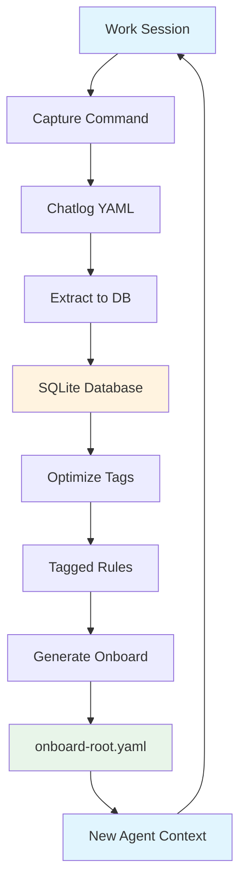

# Context Engine


A portable, drop-in tool for capturing and managing engineering decisions, constraints, and architectural knowledge across projects.

---

## Important: Claude Code Requirement

**This version requires [Claude Code CLI](https://claude.ai/code).** The slash commands (`/capture`, `/ce-extract`, etc.) and prompt templates are specifically designed for Claude Code's command system.

**Why Claude Code?**
1. **Developer access**: This is what I (the developer) have available and can test thoroughly
2. **No additional API costs**: Claude Code CLI usage is included with Claude Max and Claude Pro subscriptions—no per-token charges for development workflows
3. **Native integration**: Slash commands execute directly in your development environment

Support for other AI assistants (OpenAI, local models, etc.) is planned for future releases through a modular abstraction layer. For now, Claude Code is required.

---

## Features

- **Capture** session knowledge as structured chatlogs (YAML)
- **Extract** rules into SQLite database for queryability
- **Optimize** tags using Claude reasoning with human oversight
- **Generate** agent onboarding context from accumulated knowledge

## Workflow



**Happy Path:**
1. **Work** - Complete meaningful development session
2. **Capture** - Run `/ce-capture` to extract decisions, constraints, patterns
3. **Extract** - Process chatlogs into database rules
4. **Optimize** - Refine tags with vocabulary-aware AI reasoning
5. **Generate** - Create onboarding context for future sessions
6. **Repeat** - New agents inherit accumulated knowledge

## Installation

Choose one of the following deployment methods:

### Option 1: Git Clone (Recommended)

Clone the repository directly as `.context-engine` in your project:

```bash
cd /path/to/your/project
```

```bash
git clone https://github.com/Pewejekubam/ContextEngine.git .context-engine
```

This creates a `.context-engine` directory containing the complete runtime.

**Benefits:**
- Version-controlled deployment
- Easy updates via `git pull`
- Track customizations with git branches
- Hidden directory keeps project root clean
- No archive extraction needed

### Option 2: Tarball

Download and extract the release archive:

```bash
cd /path/to/your/project
```

**Download latest release automatically:**
```bash
curl -s https://api.github.com/repos/Pewejekubam/ContextEngine/releases/latest | grep "browser_download_url.*tar" | cut -d '"' -f 4 | wget -qi -
```

**Or download a specific version** (v3.4.0):

Using curl:
```bash
curl -LO https://github.com/Pewejekubam/ContextEngine/releases/download/v3.4.0/context-engine-runtime-v3.4.0-20251129-111720Z.tar
```

Using wget:
```bash
wget https://github.com/Pewejekubam/ContextEngine/releases/download/v3.4.0/context-engine-runtime-v3.4.0-20251129-111720Z.tar
```

**Extract:**
```bash
tar -xf context-engine-runtime-*.tar
```

**Benefits:**
- Single-file distribution
- Works in air-gapped environments
- Exact version snapshot

## Quick Start

After installation, open your project in **Claude Code** and follow these steps:

1. **Initialize Context Engine** (discovers project domains):

   Ask Claude:
   ```
   Please process commands/ce-init.md
   ```

   This analyzes your project structure and generates domain-specific configuration.

2. **Verify installation** (optional):

   In your terminal:
   ```bash
   cd .context-engine
   make help
   ```

3. **Start developing**, then **capture your session**:

   After completing meaningful work in Claude Code:
   ```
   /ce-capture
   ```

**Next:** See [docs/GETTING_STARTED.md](docs/GETTING_STARTED.md) for the complete workflow and examples.

## Directory Structure

```
.context-engine/
├── commands/          # Claude Code slash commands
├── config/            # Project configuration
├── data/              # Chatlogs and database
├── docs/              # Documentation
├── schema/            # SQLite schema
├── scripts/           # Python/shell utilities
├── templates/         # Prompt templates
└── Makefile           # Workflow automation
```

## Documentation

- [Knowledge-Driven Development](docs/KNOWLEDGE_DRIVEN.md) - Philosophy and approach
- [Getting Started](docs/GETTING_STARTED.md) - Full usage guide
- [Initialization](docs/INITIALIZATION.md) - First-time setup details
- [Upgrade Guide](docs/UPGRADE.md) - Version migration instructions
- [Distribution & Architecture](DISTRIBUTION.md) - About this repository and the build engine

## Examples

Real-world scenarios demonstrating Context Engine in action:

- **[Simple Python Project](docs/examples/01-simple-python-project)** - Individual developer or small team starting a new project
- **[Multi-Domain System](docs/examples/02-multi-domain-system)** - Team managing multiple interconnected services
- **[Team Workflow Integration](docs/examples/03-team-workflow)** - Organization standardizing knowledge across projects
- **[CI/CD Pipeline Integration](docs/examples/04-cicd-integration)** - Automating knowledge management in your workflow

Choose the example that matches your use case, or start with [Example 1](docs/examples/01-simple-python-project) if you're new to Context Engine.

## Updating

If installed via git clone:

```bash
cd .context-engine
git pull origin main
```

Your local configuration in `config/` is preserved.

## Community

- **[GitHub Discussions](https://github.com/Pewejekubam/ContextEngine/discussions)** - Ask questions, share ideas, show your use cases
- **[Issues & Bug Reports](https://github.com/Pewejekubam/ContextEngine/issues)** - Report bugs or suggest features
- **[FAQ](docs/FAQ.md)** - Common questions answered
- **[Community Guide](docs/COMMUNITY.md)** - How to engage with the community
- **[Contributing](CONTRIBUTING.md)** - How to contribute code and documentation
- **[Maintainers](MAINTAINERS.md)** - Meet the maintainers and governance model

## Roadmap

See [ROADMAP.md](ROADMAP.md) for where Context Engine is headed. Current release is **v3.4.1** (November 2025).

Have ideas? [Start a discussion](https://github.com/Pewejekubam/ContextEngine/discussions) to suggest features!

## Requirements

- Python 3.8+
- SQLite 3
- PyYAML (`pip install PyYAML` or see [requirements.txt](requirements.txt))
- Claude Code CLI (for Claude-powered features)

## License

MIT License - see [LICENSE](LICENSE) for details.
